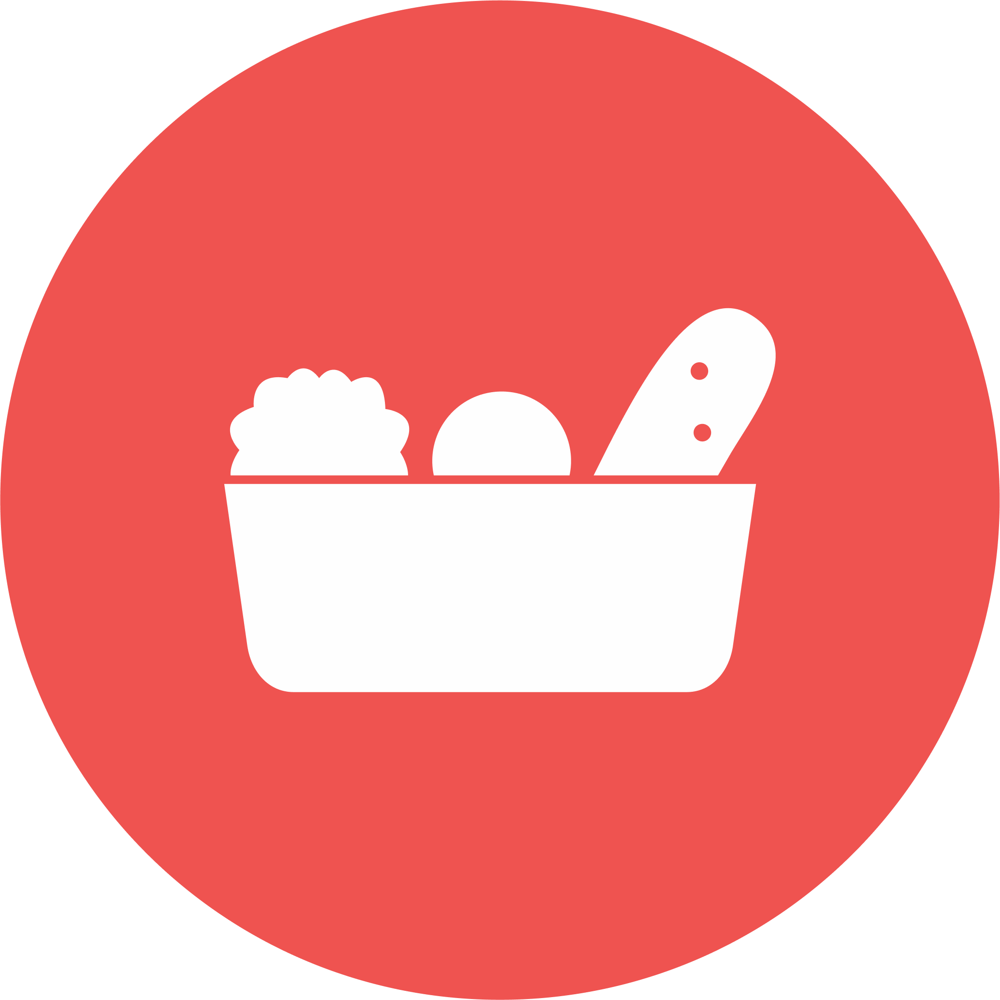

<h1 align="center">
  <br/>
Les réseaux du coeur (app mobile)</h1>

rzo-coeur-mobile-app is a mobile application built with React Native and Expo. This project is the mobile part of a project called “Les réseaux du coeur”, whose principle is similar to the "pending coffee" but for food products.

> This Project is based on [Obytes starter](https://starter.obytes.com)

## Requirements

- [React Native dev environment ](https://reactnative.dev/docs/environment-setup)
- [Node.js LTS release](https://nodejs.org/en/)
- [Git](https://git-scm.com/)
- [Watchman](https://facebook.github.io/watchman/docs/install#buildinstall), required only for macOS or Linux users
- [Pnpm](https://pnpm.io/installation)

## 👋 Quick start

Clone the repo to your machine and install deps :

```sh
git clone https://github.com/gaut-b/rzo-coeur-mobile-app

cd ./repo-name

pnpm install
```

### Generate native folders (if needed)

This project uses Expo Prebuild. The `android/` and `ios/` folders are not tracked in Git and are generated when needed:

```sh
pnpm prebuild
```

To run the app on ios

```sh
pnpm ios
```

To run the app on Android

```sh
pnpm android
```

> **Note:** The `pnpm ios` and `pnpm android` commands automatically run prebuild if the native folders don't exist.

## ✍️ Documentation

- [Rules and Conventions](https://starter.obytes.com/getting-started/rules-and-conventions/)
- [Project structure](https://starter.obytes.com/getting-started/project-structure)
- [Environment vars and config](https://starter.obytes.com/getting-started/environment-vars-config)
- [UI and Theming](https://starter.obytes.com/ui-and-theme/ui-theming)
- [Components](https://starter.obytes.com/ui-and-theme/components)
- [Forms](https://starter.obytes.com/ui-and-theme/Forms)
- [Data fetching](https://starter.obytes.com/guides/data-fetching)
